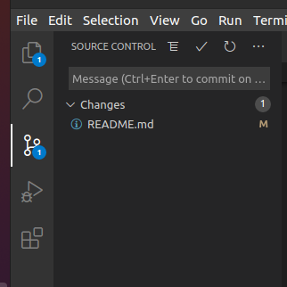
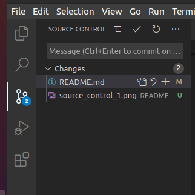
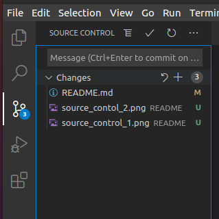
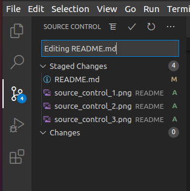
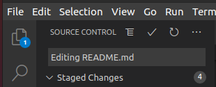
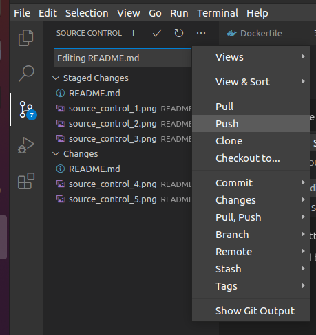

# YourFootprint - Group 17
## Adding to the readme
When editing use this as a guide: https://guides.github.com/features/mastering-markdown/

When writing code please wrap in triple backticks ```` ``` ```` before and after. If writing code for bash use ```` ```bash your code here ``` ````

For example:
```bash
your code here
```

## Initial Setup
### Creating the image
This command will build the docker image, and then run it in a container, and a rails server will be hosted on localhost:3000:
```bash
docker-compose up --build 
```
## Running bash on rails container
After the command finishes running open other terminal window and run the following command to open bash inside the container:
```bash
docker exec -it yourfootprint-group-17_web_1 /bin/bash -il
```
## Database
### Rails container
To access the database from the rails container you must first access the rails container using [this](#running-bash) command, then type:
```bash
rails db
```
The password is currently: "admin"

## Troubleshooting
### Rails container
This command will spin up a new container using the image created in [this](#creating-the-image) command (used for debugging mainly):
```bash
docker run -it --rm yourfootprint /bin/bash -il
```
### MySQL container
To access the database container directly use:
```bash
docker exec -it yourfootprint-group-17_db_1 /bin/bash -il
```
To access the database from there use:
```bash
mysql -u admin -p docker 
```
The password is currenty: "admin"

### Linux troubleshoot
#### Files owned by root
If files end up owned by root the following should be run to make current user owner of all files
```bash
sudo chown -R $(whoami).users .
```
## Pushing files to git
Make changes to project and then save them.

### First time setup
Make sure that the following configurations are set:

```bash
git config --global user.name ""

git config --global user.email "" 
```
### Using VSCode
On the left side of VSCode go to source control, your changes will appear here:



Hover over the change and click the plus to stage changes (If you are working on two separate things and need to make a commit you should split the changes into multiple commits if you can): 



Alternatively hover over the changes bar and click the plus to stage all changes:



Then add a title for your changes (be descriptive):



Then click the tick at the top bar to commit:



Click on the triple dot and click on push:



### If your commit fails

If your commit fails you might need to pull the changes from commits that others have made. To do this you open the triple dot menu and click pull and then try push again.
